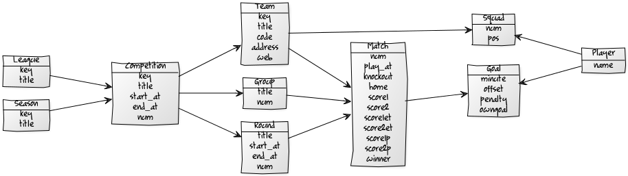

# sportdb-models gem - sport.db schema 'n' models for easy (re)use

<!--

-->

* home  :: [github.com/sportdb/sport.db](https://github.com/sportdb/sport.db)
* bugs  :: [github.com/sportdb/sport.db/issues](https://github.com/sportdb/sport.db/issues)
* gem   :: [rubygems.org/gems/sportdb-models](https://rubygems.org/gems/sportdb-models)
* rdoc  :: [rubydoc.info/gems/sportdb-models](http://rubydoc.info/gems/sportdb-models)
* forum :: [groups.google.com/group/opensport](https://groups.google.com/group/opensport)

## Usage Models

## License

The `sportdb-models` scripts are dedicated to the public domain.
Use it as you please with no restrictions whatsoever.

## Questions? Comments?

Send them along to the
[Open Sports & Friends Forum/Mailing List](http://groups.google.com/group/opensport).
Thanks!
